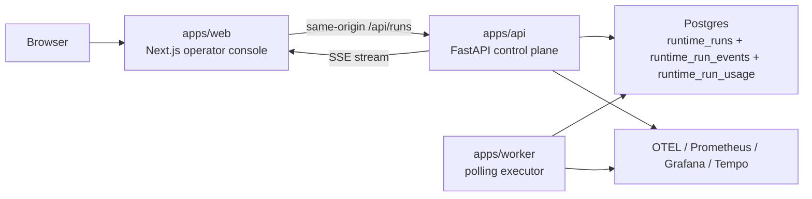

# Agent Harness Playground

This repository is already a working agent runtime monorepo, not just a scaffold.

Today it contains:

- a FastAPI control plane for durable agent runs
- a Python worker that claims queued runs from Postgres and executes workflows
- a Next.js operator console that launches runs and follows them over SSE
- shared Python packages for runtime logic, contracts, and observability
- a legacy CLI prototype in `src/basic_langgraph_agent/` that still works and is still tested

The repo still includes roadmap documents and a few legacy configuration leftovers, so this README is intentionally focused on what the code does now.

## What Runs Today

The current platform supports two workflows:

- `demo.echo`: normalizes whitespace and returns `Echo: <input>` without calling an external model
- `anthropic.respond`: calls an Anthropic-compatible `messages.create(...)` endpoint from the worker

Runs are durable. The API writes them to Postgres, the worker claims them with a lease, execution emits structured events, and the web app renders both historical state and live updates.

## Architecture



### End-to-end flow

1. The browser submits a run to `apps/web` at `/api/runs`.
2. Next.js proxies that request to `apps/api` with server-side credentials.
3. The API authorizes the request, applies migrations on startup, and inserts a run into Postgres.
4. The worker polls Postgres, claims the next runnable row, and starts a lease heartbeat.
5. `RuntimeExecutor` runs the workflow and appends `run.*`, `workflow.*`, `node.*`, `tool.*`, and `model.*` events.
6. The API streams stored events as Server-Sent Events from `/runs/{run_id}/events/stream`.
7. The run details page hydrates from stored history, then switches to live SSE updates until the run reaches a terminal state.

## Repository Map

```text
apps/
  api/        FastAPI control plane
  web/        Next.js operator console and same-origin API proxy
  worker/     Polling worker and private health endpoint
docs/
  deployment.md   Current deployment topology and canary flow
  operations.md   Current runbook and incident guidance
infra/
  docker/     Local Postgres + observability stack
  grafana/
  otel/
  prometheus/
packages/
  agent-core/       Runtime executor, workflows, Postgres store, migrations
  contracts/        Shared Pydantic models and TS contract generator
  observability/    OTEL, Prometheus, logging correlation helpers
scripts/
  production_canary.py
src/
  basic_langgraph_agent/  Legacy CLI prototype
tasks/
  Milestone docs and roadmap history
tests/
  Python tests for legacy CLI and current backend runtime
```

## Service And Package Guide

### `apps/api`

The API is the control plane. The main app lives in `apps/api/src/agent_harness_api/main.py`.

Current responsibilities:

- apply database migrations at startup
- create, list, fetch, and cancel runs
- expose run events as SSE
- enforce token-based role checks
- expose Prometheus metrics at `/metrics`

Important endpoints:

- `GET /health`
- `POST /runs`
- `GET /runs`
- `GET /runs/{run_id}`
- `POST /runs/{run_id}/cancel`
- `GET /runs/{run_id}/events/stream`
- `GET /metrics`

Authorization behavior:

- `viewer` can read runs and event streams
- `operator` can create and cancel runs
- `admin` can access `/metrics` and API docs
- if `AGENT_HARNESS_API_TOKENS` is unset, the API falls back to a no-auth mode and treats requests as admin

### `apps/worker`

The worker is the execution plane. The main loop lives in `apps/worker/src/agent_harness_worker/main.py`.

Current responsibilities:

- poll Postgres for runnable work
- claim runs with a lease so stale work can be recovered
- refresh the lease in a heartbeat thread while a run is active
- execute workflows through `RuntimeExecutor`
- persist retry scheduling, failure events, and terminal states
- expose worker Prometheus metrics and a private `/health` endpoint

Failure behavior:

- cancellation raises `ExecutionCancelled`
- timeout raises `ExecutionTimedOut`
- transient provider failures are retried up to `max_attempts`
- retry delay is persisted in Postgres as a future `scheduled_at`

### `apps/web`

The web app is a real operator surface now, not just a placeholder.

Current responsibilities:

- create runs from a dashboard form
- list recent runs
- show per-run detail pages
- fetch historical events
- follow live events via SSE
- proxy browser requests through same-origin `/api/runs` routes

Important implementation detail:

- the browser does not talk directly to the FastAPI service
- `apps/web/lib/server/api-proxy.ts` forwards requests with server-side credentials
- trusted-proxy mode can require upstream identity headers for multi-user deployments
- when trusted-proxy mode is off, local development falls back to a development session role, defaulting to `admin`

### `packages/agent-core`

This is the runtime heart of the current system.

Key pieces:

- `runtime.py`: `RunStore` protocol, `InMemoryRunStore`, `PostgresRunStore`, migrations
- `executor.py`: `RuntimeExecutor`, timeout handling, event emission, run output shaping
- `workflows/registry.py`: workflow registration
- `workflows/demo_echo.py`: demo workflow
- `workflows/anthropic.py`: Anthropic-compatible workflow and provider config loading
- `usage_tracker.py`: JSONL token usage helpers used by the legacy CLI and Anthropic workflow

### `packages/contracts`

Shared Pydantic models used by API, worker, and tests.

Important models:

- `CreateRunRequest`
- `RunRecord`
- `RunEvent`
- `WorkflowConfig`
- `TokenUsage`

The repo also generates TypeScript types for the web app from these Python models:

- source: `packages/contracts/scripts/generate_frontend_types.py`
- output: `apps/web/lib/generated/contracts.ts`

### `packages/observability`

Shared observability primitives used by both API and worker.

Provides:

- OTEL tracer setup
- trace context propagation helpers
- Prometheus metric registration
- log correlation via `run_id` and `trace_id`

## Runtime Model

### Run lifecycle

Run statuses are:

- `queued`
- `running`
- `cancelling`
- `completed`
- `failed`
- `cancelled`

### Database schema

The durable runtime currently lives in Postgres.

Main tables:

- `runtime_runs`: run state, retry policy, workflow config, lease data, trace context
- `runtime_run_events`: ordered event log per run
- `runtime_run_usage`: token usage extracted from `model.completed` events
- `schema_migrations`: applied SQL migrations

Current migrations live in:

- `packages/agent-core/src/agent_harness_core/migrations/001_runtime_tables.sql`
- `packages/agent-core/src/agent_harness_core/migrations/002_observability.sql`
- `packages/agent-core/src/agent_harness_core/migrations/003_run_policies.sql`
- `packages/agent-core/src/agent_harness_core/migrations/004_workflow_config.sql`

### Event taxonomy

The executor emits structured event types such as:

- `run.created`
- `run.queued`
- `run.started`
- `run.retry_scheduled`
- `run.completed`
- `run.failed`
- `run.cancel_requested`
- `run.cancelled`
- `workflow.started`
- `workflow.completed`
- `node.started`
- `node.completed`
- `tool.started`
- `tool.completed`
- `model.started`
- `model.completed`
- `model.failed`

The web UI reads these events directly to build its timeline and workflow graph.

## Workflows

### `demo.echo`

Defined in `packages/agent-core/src/agent_harness_core/workflows/demo_echo.py`.

Behavior:

- normalizes whitespace
- returns `Echo: <normalized_input>`
- records synthetic token usage
- does not require any external credentials

Use this workflow when you want to test the system without provider dependencies.

### `anthropic.respond`

Defined in `packages/agent-core/src/agent_harness_core/workflows/anthropic.py`.

Behavior:

- loads worker-side provider config
- normalizes whitespace
- calls `Anthropic.messages.create(...)`
- converts provider failures into typed `ProviderError` variants
- appends token usage entries to `data/token_usage.jsonl`

The worker, not the browser or web app, owns the provider credentials.

## Local Development

### Prerequisites

- Python 3.11+
- `uv`
- Node.js compatible with Next 15
- `pnpm`
- Docker

### Infrastructure

Start the local data and observability stack:

```bash
docker compose -f infra/docker/compose.yml up -d
```

That compose file currently includes:

- Postgres
- Tempo
- OTEL Collector
- Prometheus
- Grafana
- Redis

Important note: Redis is present in the compose stack but the current runtime does not use it yet. The queue is implemented directly in Postgres.

### Environment variables

Most runtime config is read from process environment.

Common variables:

- `AGENT_HARNESS_DATABASE_URL`
- `AGENT_HARNESS_API_TOKENS`
- `AGENT_HARNESS_OTEL_EXPORTER_OTLP_ENDPOINT`
- `AGENT_HARNESS_CORS_ORIGINS`
- `AGENT_HARNESS_WORKER_ID`
- `AGENT_HARNESS_WORKER_POLL_SECONDS`
- `AGENT_HARNESS_WORKER_LEASE_SECONDS`
- `AGENT_HARNESS_WORKER_LEASE_REFRESH_SECONDS`
- `AGENT_HARNESS_WORKER_RETRY_BACKOFF_SECONDS`
- `AGENT_HARNESS_WORKER_METRICS_PORT`
- `AGENT_HARNESS_WORKER_HEALTH_HOST`
- `AGENT_HARNESS_WORKER_HEALTH_PORT`
- `AGENT_HARNESS_WORKER_HEALTH_STALE_SECONDS`
- `AGENT_HARNESS_API_BASE_URL`
- `AGENT_HARNESS_API_TOKEN`
- `AGENT_HARNESS_WEB_TRUSTED_PROXY_SECRET`
- `AGENT_HARNESS_WEB_DEV_ROLE`
- `ANTHROPIC_AUTH_TOKEN` or `ANTHROPIC_API_KEY`
- `ANTHROPIC_MODEL`
- `ANTHROPIC_MAX_TOKENS`
- `ANTHROPIC_BASE_URL`
- `API_TIMEOUT_MS`

Important note about config drift:

- `.env.example` still contains legacy `NEXT_PUBLIC_API_BASE_URL` and `NEXT_PUBLIC_API_TOKEN` entries
- the current web server code does not use those variables
- the actual web proxy reads `AGENT_HARNESS_API_BASE_URL` and `AGENT_HARNESS_API_TOKEN`

Also note:

- the Python services do not automatically load `.env` on startup
- the Anthropic workflow helper loads the project `.env` opportunistically for provider config
- for local service startup, export env vars in your shell or use your own env loader

### Install

```bash
make install-python
make install-web
```

Equivalent commands:

```bash
uv sync
cd apps/web && pnpm install
```

### Start the stack

Run each service in its own terminal:

```bash
make dev-api
make dev-worker
make dev-web
```

Defaults:

- API: `http://127.0.0.1:8000`
- Web: `http://127.0.0.1:3000`
- Worker metrics: `http://127.0.0.1:9101/metrics`
- Worker health: `http://127.0.0.1:9102/health`
- Grafana: `http://127.0.0.1:3000` inside the Docker stack unless that port is already occupied by the web app

If you run both the web app and Grafana locally, you will need to change one of the ports.

### Minimal happy path

1. Start Docker services.
2. Export `AGENT_HARNESS_DATABASE_URL`.
3. Export `AGENT_HARNESS_API_TOKENS` and a matching `AGENT_HARNESS_API_TOKEN` for the web proxy.
4. Start API, worker, and web.
5. Open the dashboard and launch a `demo.echo` run.
6. Open the run detail page and confirm live SSE updates.

## Commands

Root `Makefile` targets:

- `make install-python`
- `make install-web`
- `make lint`
- `make typecheck-python`
- `make typecheck-web`
- `make typecheck`
- `make test`
- `make ci`
- `make dev-api`
- `make dev-worker`
- `make dev-web`
- `make production-canary`

Useful direct commands:

```bash
uv run pytest
pnpm --dir apps/web test
pnpm --dir apps/web build
uv run basic-agent --model "your-model" "Say hello"
uv run basic-agent-usage
```

## Testing

The test surface is split by runtime:

- `tests/test_backend_runtime.py`: current API, worker, workflows, auth, traces, retries, health
- `tests/test_postgres_migrations.py`: Postgres-backed migration coverage
- `tests/test_agent.py`: legacy CLI prototype and usage-tracker behavior
- `apps/web/test/api-routes.test.ts`: Next.js proxy route behavior

Notes:

- `make test` runs the Python tests only
- web tests are separate: `pnpm --dir apps/web test`
- Postgres migration tests require `AGENT_HARNESS_TEST_DATABASE_URL`

## Legacy Versus Current Code

The repo contains two layers of history:

### Current runtime path

Use these first if you want to understand the system as it exists now:

- `apps/api`
- `apps/worker`
- `apps/web`
- `packages/agent-core`
- `packages/contracts`
- `packages/observability`

### Legacy prototype path

These files are still runnable and still tested, but they are no longer the main architecture:

- `src/basic_langgraph_agent/agent.py`
- `src/basic_langgraph_agent/usage_tracker.py`

The legacy CLI now delegates much of its provider logic to code in `packages/agent-core`.

## Docs Worth Reading Next

Current operational docs:

- `docs/deployment.md`
- `docs/operations.md`

Historical roadmap docs:

- `tasks/README.md`
- `tasks/01-repo-foundation.md` through `tasks/10-production-topology-and-rollout.md`

Use the `docs/` files for present-day behavior. Use the `tasks/` files to understand why the repo is shaped this way and what work remains.
